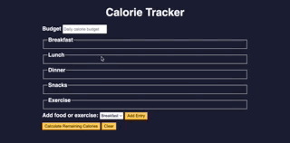

# CALORIES TRACKER APP

The application was built as a practice project for a JavaScript Algorithms and Data Structures course with FreeCodeCamp. It features a calorie tracker designed to help users manage their daily calorie intake and expenditure. Developed with HTML, CSS, and JavaScript, the app incorporates basic regular expressions, template literals, the addEventListener() method, and validated user inputs. It performs calculations based on those inputs and dynamically updates the interface.

## Features

- Form for inputting calories and food/exercise names: A user-friendly form that allows users to input the number of calories and the names of foods or exercises. Designed to compute daily calorie intake and expenditure accurately;
- Add Entry Button that enables users to add new entries dynamically. Each entry updates the interface in real-time, ensuring that users can easily manage and review their daily entries;
- Calculate remaining calories button that computes whether users are in a calorie deficit or surplus. This calculation is based on all inputs entered into the form. The result is displayed dynamically, helping users track their progress toward their daily calorie goals;
- Clear button that allows users to reset the form, clearing all entries and calculations. This feature provides users with a fresh start for a new day or session;

## Technologies

- HTML
- CSS
- JavaScript

## Start the App

In the project directory, you can run it with the Live Server by right-clicking on index.html.

It will run the app in development mode.\
Open [http://127.0.0.1:5500](http://127.0.0.1:5500/index.html) to view it in your browser.

When making changes, make sure you reload to see it on the page.

### Author

[Tanimara Elias Santos](https://github.com/tanimaraeliassantos)

### Version

1.0.0
